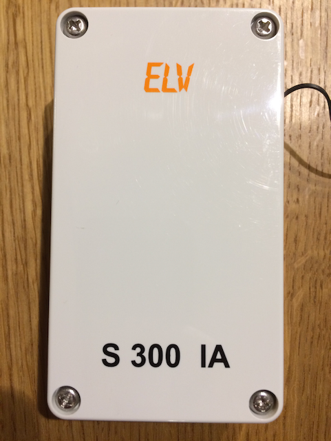
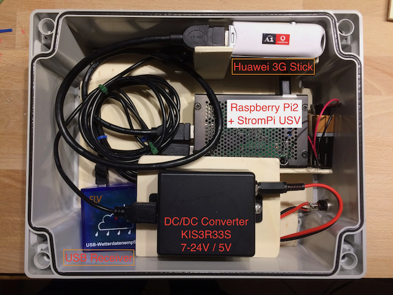
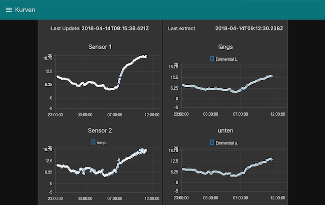
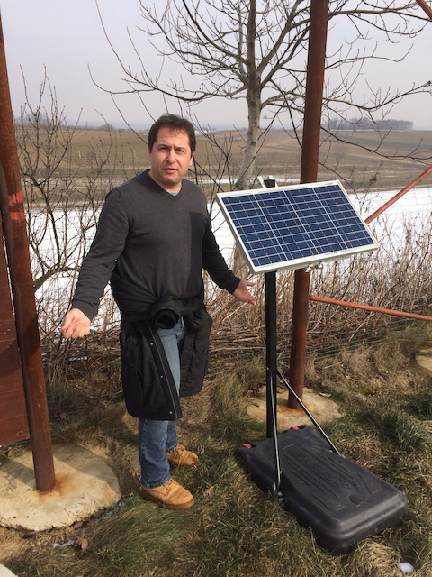

# Marille

Typ: `Forstüberwachung`

## Das Problem

Spätfrost wie er im April oder sogar Mai noch vorkommt, kann Marillenkulturen stark beschädigen. Durch die dadurch entstehenden Ernteausfälle ist das Risiko eines grossen wirtschaftlichen Schadens für Marillenbauern gegeben. 
Durch zielgerichtetes "heizen" (anzünden von in den Reihen verteilten Kübeln mit Paraffinöl) kann das Risiko gesenkt werden.

## Die Idee

Überwachung der Felder mit Temperatur-Sensoren um ständig aktuelle Daten für etwaige Massnahmen zur Verfügung zu haben.

## Gegebenheiten und Anforderungen

* Felder liegen teilweise weit ausserhalb von Ortschaften
* kein Strom-Anschluss vorhanden
* Aktuelle Daten mindestens alle 10 Minuten

## Umsetzung

Prototyp auf einem Feld im Frühjahr 2018 installiert

* 4 Funk-Temperatur Sensoren ELV S 300 IA (Reichweite lt Hersteller bis zu 100m)
* 1 Funk-Feuchtigkeitssensor ELV

* Zentraleinheit bestehend aus
    * Raspberry Pi 2B+
    * ELV USB WDE1-2 Funk-Empfänger
    * USB GSM Stick
    * Solar-Panel mit Optima Puffer-Batterie

* Backend und Dashboard mit Node-Red auf IBM-Cloud

## Architektur

`to be created`

## Erkenntnisse

### Die Feuchtemperatur

Es ist falsch anzunehmen, sobald das Thermometer unter 0 Grad fällt, wird es für die Pflanzen gefährlich. Was wir am Thermoeter gewohnt sind zu sehen, ist die `Feuchttemperatur`. Für die Pflanzen können aber bereits 3 °C gefährlich sein, während sie andererseits auch trockene Nächte bei -2 °C durchaus überstehen können. Man ahnt es bereits, es sind noch mehrere Faktoren zu berücksichtigen.

Die wichtigste - messbare - Grösse ist die die Feuchttemperatur. Einen Einblick gibt [dieser Link](https://github.com/psychrometrics/psychrolib/blob/master/docs/overview.md). 

Sie hängt - zumindest - ab von:
* Trockentemperatur
* Luftfeuchte
* Luftdruck

Sie zu messen ist nur mit Spezialsensoren möglich.

Eine brauchbare Annäherung ist über Formeln möglich, ein gutes Beispiel ist https://www.schweizer-fn.de/lueftung/feuchte/feuchte.php#feuchtktemp

In unserem Projekt haben wir deshalb noch einen Luftfeuchte-Sensor verwendet und den Luftdruck von einer Wetter-Seite bezogen. Erst dadurch wurde es möglich, die notwendigen Daten zu generieren.

Der Vollständigkeit halber ist noch zu erwähnen: Der zweite grosse Einflussfaktor für Forstschäden ist das Stadium der Pflanze selbst, je weiter die Triebe schon gediehen sind, desto gefährlicher. Dieser Faktor ist nicht messbar und kann nur vom Landwirt selbst beurteilt werden.

### Datenübertragung

Die Datenübertragung über Funk erwies sich in der Praxis als unbrauchbar. Die versprochenen 100 m Reichweite wurden nicht erreicht, bei einem Abstand > 50 m zur Zentraleinheit kam es zu teilweisem oder komplettem Datenverlust.

Diese Erkenntnis war der Startschuss zur Suche nach Alternativen, wobei wir bei `LoraWan` / `The Things Network` fündig wurden.

### Sensoren

Gute Sensoren kosten gutes Geld. 

Die ELV Produkte mögen zwar für simple Wetterstationen ausreichend genau sein, beim Einsatz rund um den Nullpunkt ergaben sich jedoch zuviele Abweichungen.

### Raspberry mit Batterie-Betrieb

Die Zentraleinheit erfüllte ihren Dienst sehr zufriedenstellend. Die Stromversorgung klappte selbst in einer Woche mit tiefen Minus-Temperaturen und Bewölkung ausgezeichnet.

## Fazit

Obschon es beim Test-Betrieb blieb war das Projekt wirklich extrem lehrreich, weitere folgten.
