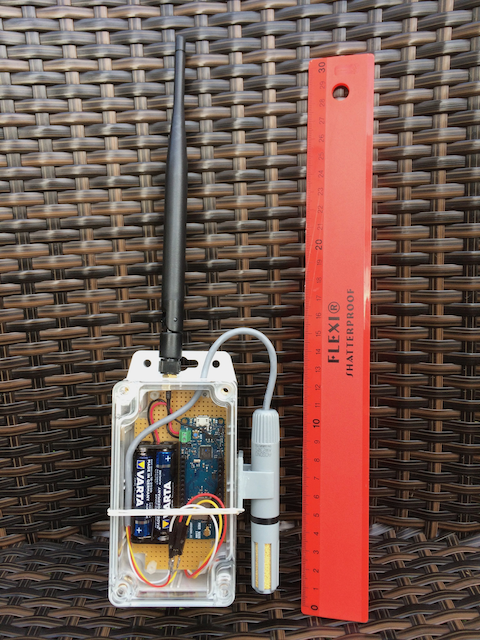
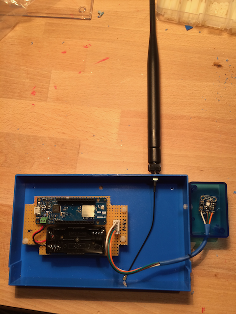
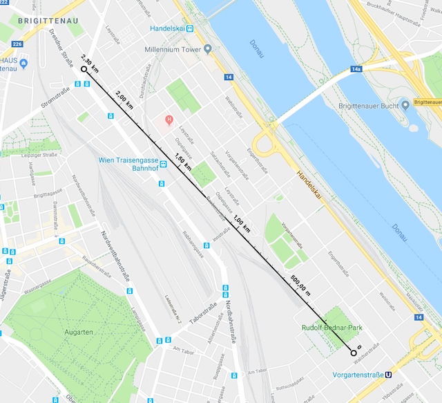

# Arduino MKRWAN1300

Nach den ersten Erfahrungen aus dem Projekt "Marille" war der nächste Schritt, den ersten Protoypen auf LoraWAN Basis zu bauen.

## Die Idee

Ist es möglich, eine batteriebetriebene Node zu bauen, die Temperatur-Messungen vornimmt und die Daten dann über weite Strecken übermittlen kann.

## Umsetzung

* zwei Arduino MKRWAN1300 Boards
* Temperatur Sensoren
    * Si7021
    * AM2305
* Gehäuse mit 868 MHz Antenne
* LoraWAN über TTN (the things network)
* Backend und Dashbaord mit Node-Red auf IBM Cloud

## Architektur

`to be created`

## Prototyp 1

Das Foto zeigt Board 1 verbaut in einem wasserdichten Gehäuse. Strom wird über zwei AAA-Batterien bereitgestellt. Der AM23205 ist aussen montiert.

## Prototyp 2

Das Board 2 ist nur behelfsmässig verbaut, ebenfalls über AAA-Batterien betrieben, hat jedoch einen Si7021 als Sensor angeschlossen.

## Erkenntnisse

### Reichweite

Im TTN gibt es keine fixe Netzabdeckung, die sogenannten Gateways - das sind die Lora-Empfänger - werden von Mitgliedern der Community privat betrieben. Über die TTN Console war sichtbar, dass die Nachrichten der beiden Boards von einem über 2 km entfernten Gateway empfange wurden. Das ist beachtlich, zumal die Tests im dicht verbauten Stadtgebiet stattfanden.

### Batterielaufzeit

Coming soon ...